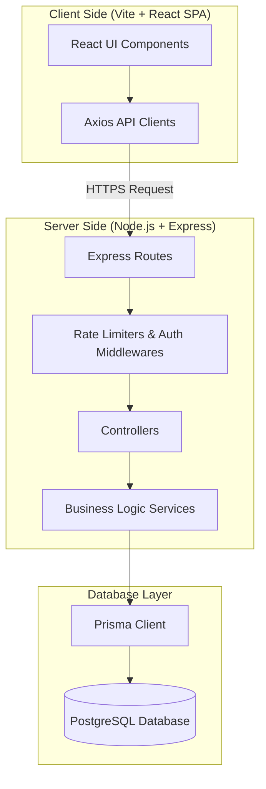

<div align="center">


# 🎯 CLASS D HACKATHON

## Smart Check-In / Check-Out Attendance System

### 🚀 QR-Based • Real-Time • Secure • Scalable

<br>

<a href="https://check-in-check-out-nhav.onrender.com">

</a>

<a href="https://github.com/yogabalan07/check-in-check-out">

</a>

<a href="https://check-in-out-s0r8.onrender.com/api/health">

</a>

</div>

---

# 📸 Project Overview

<div align="center">


</div>

---

# 🧠 About The Project

The **Class D Hackathon Check-In / Check-Out System** is a complete web-based attendance management platform developed to replace traditional manual attendance methods during hackathons and technical events.

During a large-scale event, manually recording participant attendance can create several problems:

- Long queues at the entrance
- Manual register maintenance
- Duplicate attendance
- Incorrect timestamps
- Difficulty tracking participants inside halls
- Difficulty identifying late arrivals
- Difficulty identifying early departures
- Time-consuming report generation
- Difficulty handling hundreds of simultaneous participants

This project solves these problems using a **QR-based digital attendance workflow**.

Participants only need to:

```text
📱 Scan QR
     ↓
📝 Enter Register Number
     ↓
✅ Check-In
     ↓
🏆 Participate
     ↓
📱 Scan Check-Out QR
     ↓
🚪 Check-Out
```

---

## 📝 Detailed Project Description

The Class D Hackathon Attendance System is designed to manage event logistics efficiently. Built as a concurrent-safe, high-speed solution, the platform tracks attendee check-ins/check-outs at specific gate locations or presentation halls.

Traditional attendance methods break down when hundreds of participants arrive or depart simultaneously. By using **dynamically configured gate stations** with dedicated QR codes, the system automatically tags records with locations, timestamps, and compliance indicators (such as late arrival or early exit).

---

## ⚡ Technology Stack

### Frontend (Static SPA Web App)
*   **Library:** React 18 (TypeScript)
*   **Bundler:** Vite
*   **Styling:** TailwindCSS 3 & Autoprefixer
*   **Routing:** React Router DOM (v6)
*   **HTTP Client:** Axios
*   **UI Notifications:** React Hot Toast
*   **Icons:** React Icons

### Backend (RESTful Web Service API)
*   **Runtime:** Node.js (TypeScript)
*   **Framework:** Express
*   **ORM:** Prisma ORM
*   **Security & Safety:**
    *   `helmet` (HTTP headers security)
    *   `express-rate-limit` (High concurrent rate limiting protection)
    *   `bcrypt` (Secure password hashing)
    *   `jsonwebtoken` (JWT stateless session authentication)
    *   `zod` (Robust schema-based request validation)

### Database
*   **Engine:** PostgreSQL (hosted in production, local dev integration available)
*   **Concurrency Guard:** Strict database-level partial unique indexes preventing race conditions (multiple concurrent check-ins or check-outs).

---

## 🏛️ System Architecture

The application is structured as a decoupled monorepo containing distinct `frontend` and `backend` services.



### 🔒 Concurrency & Safety Controls
During peak hackathon hours (e.g., check-in deadline), high concurrent requests can cause race conditions. This system implements:
1.  **Fast Pre-Checks:** Pre-flight indexed query checks to reject duplicate requests before hitting write transactions.
2.  **Database-Level Partial Unique Indexes:**
    *   `Attendance_participantId_checkedIn_key` ON `Attendance("participantId") WHERE status = 'CHECKED_IN'` ensuring a participant cannot check in twice concurrently.
    *   `Attendance_participantId_activeCheckout_key` ON `Attendance("participantId") WHERE "checkInTime" IS NOT NULL AND "checkOutTime" IS NULL` ensuring only one active check-in session is open at a time.
3.  **Atomic Updates via Prisma Transactions:** Atomic claims in the update queries check that the status has not changed during concurrent check-out operations.

---

## 🛠️ Admin Panel Features

The admin workspace provides a comprehensive toolset for organizers:

*   📊 **Real-Time Live Dashboard:** Displays live-updating cards:
    *   Total registered participants
    *   Total checked in
    *   Total checked out
    *   Currently inside the venue
    *   Late check-ins
    *   Early check-outs
*   👥 **Participant Management:** Full CRUD operations for hackathon attendees. Includes a robust **CSV/Excel file importer** to register participants in bulk and custom search capabilities.
*   🕒 **Attendance Log:** A paginated, searchable, and sortable data table tracking check-in/out times, halls, late status, and early checkout status.
*   🏷️ **Dynamic QR Generation:** Instantly generate QR codes for check-in/out stations.
*   ⚙️ **Hackathon Settings:** Customize parameters like the hackathon name, start time (late threshold), end time (early checkout threshold), and timezone (`Asia/Kolkata` by default).
*   📈 **Export Reports:** Generate and download CSV reports filtered by dates, status, or halls.

---

## 🔄 Project Workflows

### 🚶 Participant Workflow
```mermaid
sequenceDiagram
    autonumber
    Participant->>QR Station: Scans Station QR Code
    QR Station-->>Participant: Redirects to Web Portal
    Participant->>Web Portal: Enters Registration ID / Number
    Web Portal->>API Server: POST /api/attendance/check-in or check-out
    API Server->>Database: Validates participant & session status
    Database-->>API Server: Returns Success/Error status
    API Server-->>Web Portal: Sends JSON Response
    Web Portal-->>Participant: Displays status success (with toast notification)
```

### 📋 Full System Lifecycle Workflow
1.  **Registration & Setup:** Admin uploads participant list via Excel/CSV on the Admin Panel.
2.  **QR Station Setup:** Admin configures and displays QR codes at the entry/exit gates.
3.  **Real-Time Tracking:** As participants scan and verify their Register Number, their statuses are updated instantly on the admin's live dashboard.
4.  **Reporting:** At the end of the hackathon, the admin exports the logs for analysis or cert generation.

---

## 🚀 Deployment Information

This project is configured for deployment on [Render](https://render.com) using the `render.yaml` Blueprint spec.

*   **Database:** PostgreSQL (with migration deploy scripts on startup).
*   **Backend Service (`hackathon-attendance-api`):** Deployed as a web service running Node.js. Running npm commands: `npm install && npm run build`, `npm run start:prod` and automatic `prisma migrate deploy && node dist/server.js`.
*   **Frontend Service (`hackathon-attendance-web`):** Deployed as a high-speed static publishing site from the `dist` directory, pre-built using `npm run build`.

---

## 🔗 Live Links & Repository

*   🌐 **Live Frontend Application:** [https://check-in-check-out-nhav.onrender.com](https://check-in-check-out-nhav.onrender.com)
*   ⚙️ **Live Backend API Gateway:** [https://check-in-out-s0r8.onrender.com/api](https://check-in-out-s0r8.onrender.com/api)
*   🖥️ **GitHub Source Repository:** [https://github.com/yogabalan07/check-in-check-out.git](https://github.com/yogabalan07/check-in-check-out.git)

---

## 👨‍💻 Developer Information

*   **Developer:** Yogabalan
*   **GitHub Profile:** [@yogabalan07](https://github.com/yogabalan07)
*   **Project Workspace:** `yogabalan07/check-in-check-out`
